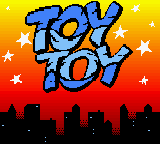
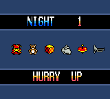
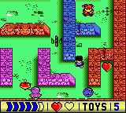

# ToyToy
1k 4way breakout clone 
## Tech Infos
* Game Boy Color
* LR35902 8bit CPU 
* Pure assembler code
## Screenshots

## Authors
* **Tomasz Słanina** - [dox](https://github.com/tslanina)
## License
This project is licensed under the GPL v3 License - see the [LICENSE](LICENSE) file for details
